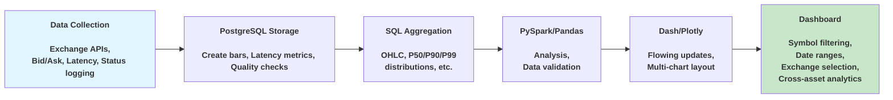

# ExchangeAgg

End-to-end analytics platform that processes live cryptocurrency data from multiple exchanges, transforms it with PySpark, and serves interactive Dash dashboards for data analytics such as: latency, spreads, and volatility.

## Features

- PySpark ETL pipeline for transforming live cryptocurrency quotes into OHLC bars and cross-exchange spread metrics.
- P50/P90/P99 API latency tracking across exchanges, plus rolling last 5m summary stats table.
- HTTP error rate monitoring and structured logging.
- Rolling regression residuals, spreads, and volatility forecasts computed via PySpark to power cross-exchange analytics.
- Interactive dashboards built with Plotly Dash for real-time visualization.
- Data quality safeguards including ETL state management, duplicate detection, and comprehensive logging.
- Modular design to support the easy addition of new exchanges or currency pairs.
- Multiprocessing orchestrator (main.py) coordinating API data collection, Spark analytics, and Dash dashboards.


## Architecture
The platform consists of three main components:
* **TypeScript collection service** that streams live quotes and metadata from multiple exchanges into PostgreSQL.
* **PySpark analytics jobs** that build OHLC bars, compute spreads, latency statistics, and rolling volatility / regression metrics.
* **Dash dashboards** that query PostgreSQL and present real-time and historical analytics for latency, spreads and data quality.


## Quick Start (Local)
1. Clone the Repository
 ```bash
 git clone https://github.com/Chicago-tr/ExchangeAggregator.git
  ```
2. Install Dependencies
```bash
cd ExchangeAggregator
#Postgres
brew install postgresql@16
brew services start postgresql@16
createdb name_your_db

#Python deps
pip install -r python_service/requirements.txt

# TypeScript deps
cd typescript_service && npm install && cd ..
```
3. Configure environment variables such as DB_URL and DB_NAME (check .env.example)
   
4. Migrate database
```bash
npx drizzle-kit migrate
```

6. Run the platform
```bash
python main.py
```
This will start the orchestrator that:
* Launches API data collection processes.
* Triggers PySpark analytics jobs.
* Serves the Dash dashboards.

## Screenshots
Price & spread by exchange and cross-exchange spreads:


---
---
Rolling regression residuals and summary statistics:


---
---
Residuals Z-score with standard deviation bars:


---
---
GARCH volatility forecast and summary statistics:


---
---
1-Minute Latency distribution and P50/P90/P99 by exchange:


## Contributing
All contributions welcome, just fork the repo, create a feature branch, and open a pull request to ```main```.

